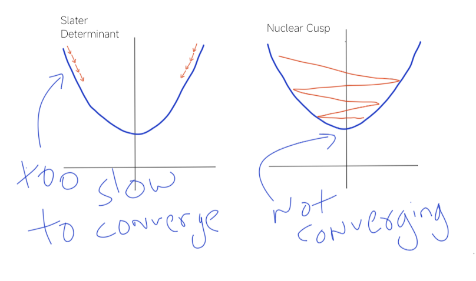

# Neural Variational Monte Carlo (Helium)

A minimal implementation of **Variational Monte Carlo (VMC)** using a neural wavefunction to approximate the ground state energy of the Helium atom.

This project explores how **physical structure and neural parameterization interact** in variational quantum methods, with a focus on optimization behavior rather than final accuracy.

---

## Overview

The wavefunction is modeled in log-space as:

ψ(x) = exp( log ψ_spatial + Jastrow )

- **ψ_spatial**: neural spatial ansatz with explicit physical structure

- **Jastrow factor**: captures electron-electron correlation

Sampling is performed using Metropolis–Hastings, and optimization is driven by the variational principle.

---

## Convergence Behavior (Current Investigation)



The figure illustrates the optimization behavior observed during training.

- **Slater determinant (left):**  
  Provides correct antisymmetric structure and a well-behaved energy landscape,  
  but exhibits **very slow convergence**. Gradients are weak, making optimization inefficient.

- **Nuclear cusp ansatz (right):**  
  Enforces correct short-range electron–nucleus physics and improves early optimization,  
  but introduces **instability**, preventing consistent convergence.

### Current Direction

The present implementation prioritizes the **nuclear cusp formulation** to stabilize early training.

The next step is to **reintroduce structured antisymmetry (Slater determinant)** in a controlled manner,  
rather than training it from scratch.

This is treated as a **continuation problem**:  
starting from a stable physical prior and gradually increasing expressivity.

---

## Project Structure

```
.
├── main.py           # Entry point
├── train.py          # Training loop
├── wavefunction.py   # Combines spatial ansatz + Jastrow
├── slater.py         # (Experimental) Slater determinant implementation
├── jastrow.py        # Correlation factor
├── sampler.py        # Metropolis-Hastings sampling
├── hamiltonian.py    # Local energy computation
├── distances.py      # Electron distance calculations
├── config.py         # Hyperparameters
```

---

## Motivation

This project is a direct exploration of **variational quantum mechanics as an algorithm**.

Instead of relying on:

- closed-form wavefunctions

- deterministic orbital evaluation

we move to:

- learned representations

- stochastic sampling

- gradient-based energy minimization

The goal is not just accuracy, but understanding:

- how physical constraints affect optimization

- how correlation emerges from simple parameterizations

- how sampling interacts with noisy gradients

- where instability arises in log-space formulations

---

## Architecture

### Wavefunction (`wavefunction.py`)

Combines:

- spatial ansatz (currently cusp-based)

- Jastrow factor

Outputs log|ψ| for numerical stability.

---

### Spatial Ansatz (`slater.py` / current implementation)

Current model:

- explicit **nuclear cusp condition**: exp(-Z (r₁ + r₂))

- neural correction to orbital structure

This provides a strong physical prior near singularities.

A Slater determinant formulation exists but is **not currently active** due to poor convergence behavior during initial training.

---

### Jastrow Factor (`jastrow.py`)

- Padé form correlation function

- Learnable parameters

- Encodes short-range electron-electron behavior

---

### Sampling (`sampler.py`)

- Metropolis–Hastings updates

- Log-probability ratio for stability

- No drift term (pure random walk)

---

### Local Energy (`hamiltonian.py`)

Computed via automatic differentiation:

- gradient of logψ

- Laplacian via second derivatives

Kinetic term:

T = -½ (∇² logψ + |∇ logψ|²)

Potential includes:

- electron–nucleus attraction

- electron–electron repulsion

---

### Training (`train.py`)

- Variational energy minimization

- Variance-reduced gradient estimator

- Adam optimizer with learning rate decay

---

### Entry Point (`main.py`)

- initializes walkers

- performs thermalization

- runs optimization loop

---

## Numerical Strategy

### Representation

- Log-space wavefunction to prevent overflow

- Explicit handling of Coulomb singularities

---

### Sampling

- Walkers represent electron configurations

- Distribution converges to |ψ|²

---

### Optimization

Loss:

L = ⟨ (E_L - ⟨E_L⟩) logψ ⟩

Avoids explicit normalization of the wavefunction.

---

## Running

```bash
python main.py
```

Output:

```
step N  E = ...  var = ...
```

Reference value:

```
Helium ground state ≈ -2.903 Hartree
```

---

## Limitations

- Restricted to two-electron systems

- No explicit spin formalism

- No importance sampling (no drift term)

- CPU-only execution

- Second-order autodiff is computationally expensive

### Current Technical Issue

The main bottleneck is **optimization stability**, not model expressivity.

- Slater determinant: stable but too slow

- Cusp-based ansatz: faster but unstable

Resolving this tradeoff is the central focus of the project.

---

## Future Directions

- Controlled interpolation between cusp and Slater representations

- Drift-diffusion (importance sampling)

- Multi-determinant expansions

- GPU acceleration

- Efficient Laplacian computation

- Equivariant neural architectures

- Scaling beyond two-electron systems

---

## References

1. J. C. Slater, Phys. Rev. **34**, 1293 (1929)

2. D. R. Hartree, Math. Proc. Cambridge **24**, 89 (1928)

3. R. Jastrow, Phys. Rev. **98**, 1479 (1955)

4. T. Kato, Commun. Pure Appl. Math. **10**, 151 (1957)

5. E. A. Hylleraas, Z. Phys. **54**, 347 (1929)

6. Umrigar et al., J. Chem. Phys. **99**, 2865 (1993)

7. Chauhan & Harbola, arXiv:1506.00912

8. Pfau et al., Phys. Rev. Research **2**, 033429 (2020)

9. Ceperley & Alder, Science **231**, 555 (1986)

---


## Author

Lnifelias Stargarden  
Real name: Bhaskar Malviya

Computational Chemistry | Quantum Chemistry | Scientific Programming

---
